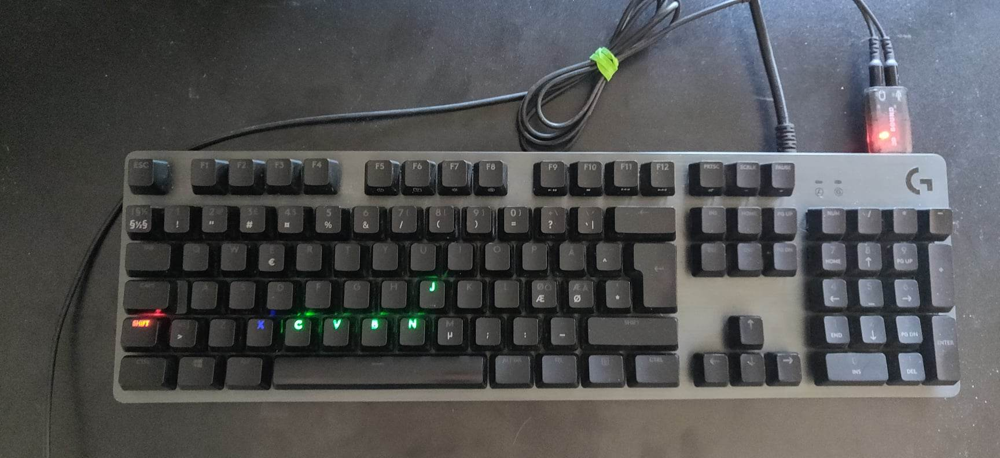
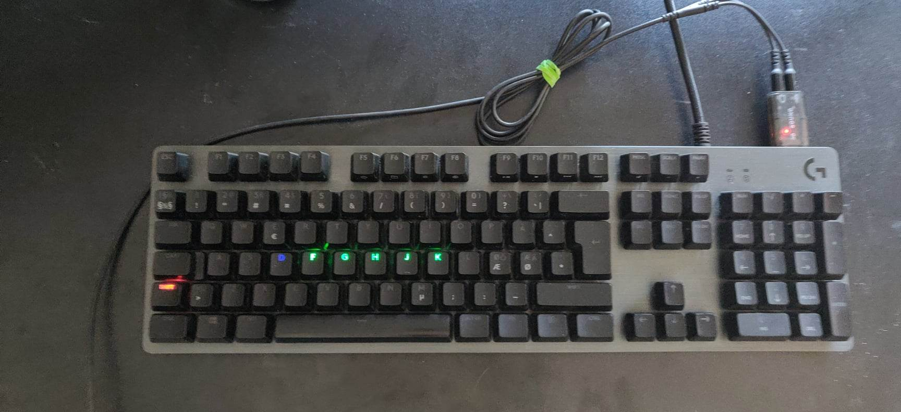
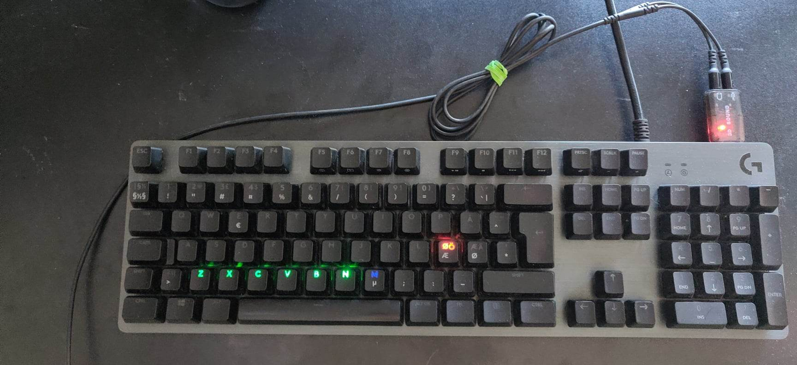

# KeyboardSnake
This was a fun project made for my new logitech keyboard, to better get to know the capabilities of the lumination API.

## Display and controls
By default the game displays both on keyboard and in the console window.

The game is controlled by Arrow keys, with a blue indicator showing where the snake will move next 'turn'.

Following is pictures are of the game being played:

